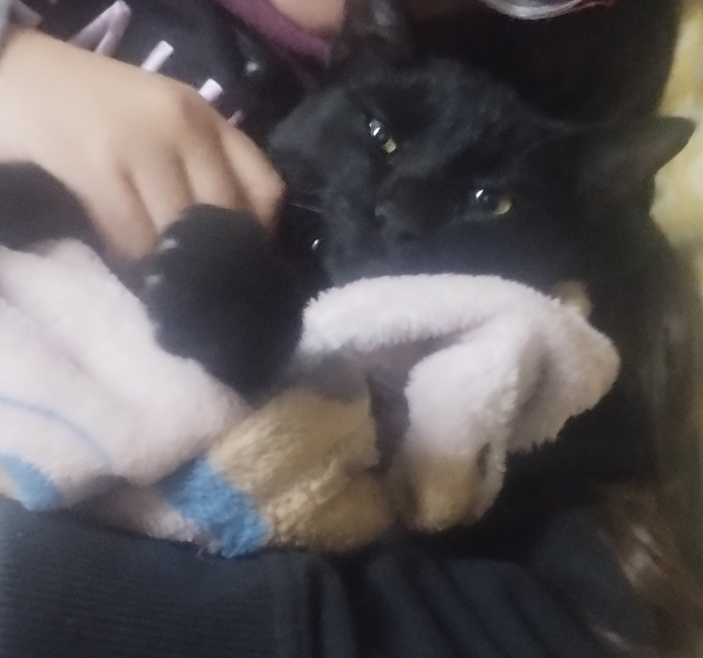

# Ivan Battilana
## Presentación Personal

Soy Ivan Agustin Battilana, tengo 22 años, vivo en Moreno,
Paso Del Rey. Vengo a la unahur estudiar en la Tecnicatura De Videojuegos siempre en colectivo desde moreno.
Vivo con mi familia de 7 personas, no somos los de mayor lujo pero nos acomodamos bien. Ayudo en mi casa con los quehaceres y el negocio de comida de mi mama. Yo que llevo ya tres años en esta universidad les puedo decir que me encanta empezar una materia interesante como esta. Espero que nos llevemos bien en esta cursada de POO-1.

### Imagen del gato de mi hermana llamado COCO.

#### Cosas que me gustan

-Me gusta cocinar pastas y salsas de muchos tipos. 

-Me encanta salir de paseo con mi cuaderno de dibujo para dibujar al aire libre. 

-Me gustan las historias, ya sean en comics, documentales o en libros (aunque mas comics). 

-Me encanta la animacion en general ya sea 3D o 2D, de pequeño queria hacer mis propios dibujos animados. 

-Lo que ahora mismo me obsesiona es el diseño de videojuegos, es decir como crear una experiencia que se interprete como divertida para el jugador.

